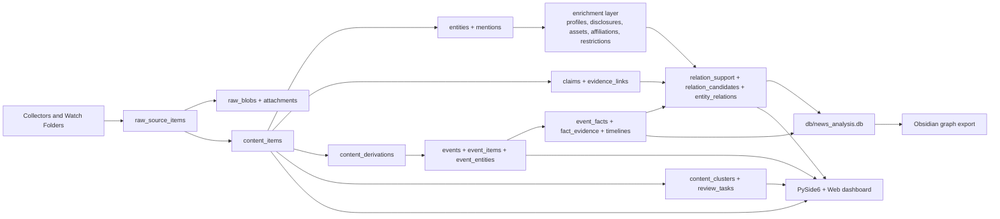

# Civic Evidence Lab

Windows-first evidence pipeline for collecting public signals, documents, files, images, official records, and building explainable dossiers, relations, and review workflows on top of them.

> Status: actively maintained local research system with green `nightly -> quality_gate -> analysis_snapshot -> obsidian_export` pipeline.

## Contents

- [Overview](#overview)
- [What the project does](#what-the-project-does)
- [Core principles](#core-principles)
- [Architecture](#architecture)
- [Pipeline](#pipeline)
- [Data model](#data-model)
- [Source health and quality gates](#source-health-and-quality-gates)
- [Validated local status](#validated-local-status)
- [Repository structure](#repository-structure)
- [Quick start](#quick-start)
- [Configuration](#configuration)
- [Runtime and operations](#runtime-and-operations)
- [AI Sweep](#ai-sweep)
- [Review Ops](#review-ops)
- [Obsidian export](#obsidian-export)
- [Verification](#verification)
- [Known limits](#known-limits)
- [Next development priorities](#next-development-priorities)

## Overview

`Civic Evidence Lab` is not a news re-poster and not a flat parser of random feeds.

It is a local dossier-building system that:

- ingests public signals from official sites, registries, Telegram exports, watch-folders, and uploaded files;
- normalizes them into canonical content, entities, claims, events, facts, evidence, and enrichment facts;
- keeps the original files on disk and the canonical metadata in SQLite;
- builds relation candidates, explainable bridge-paths, and review queues instead of publishing raw assumptions as facts;
- runs a 24/7 daemon outside the UI and publishes analysis snapshots only after quality gates pass;
- exports the knowledge graph and supporting archive into Obsidian.

The project is optimized for local Windows execution, long-running collection, and evidence-first review rather than “maximum recall at any cost”.

## What the project does

### Collection and normalization

- Telegram, watch-folder, YouTube/manual media, official registries, official sites, state-company reports, executive directories.
- Canonical file storage via `raw_blobs` and `attachments`.
- OCR/ASR/document extraction for images, PDFs, and video/audio-derived materials.

### Enrichment

- Official positions and leadership directories.
- Personal profiles, photos, disclosures, compensation, declared assets.
- Company affiliations and state-company management data.
- Restriction events, justifications, and source-linked evidence.

### Relation engine

- Structural edges for official roles and formal ties.
- Candidate relations with support-layer accounting.
- Bridge-node graph for explainable paths through claims, cases, bills, contracts, disclosures, assets, restrictions, and documents.

### Review and publication

- `Review Ops` queues for duplicates, affiliations, restrictions, and source-health issues.
- `quality_gate` before `analysis_snapshot` and `obsidian_export`.
- Obsidian graph export with canonical notes instead of source-hub spam.

## Core principles

1. **Source is not fact.**
   A post, page, or video is a signal. A registry entry, contract, vote record, court document, or official profile is evidence.

2. **Precision first.**
   The pipeline prefers abstaining or sending something to review over promoting weak or noisy output.

3. **Canonical storage, derived projections.**
   Raw content, files, facts, relations, review queues, dashboard cards, and Obsidian notes are treated as different layers with different purposes.

4. **Explainability is mandatory.**
   Promoted relations and dossier views must be explainable through bridge-paths and evidence references.

5. **Fallbacks must be explicit.**
   Archive-derived and fixture-backed sources are allowed, but they must be marked as such and never silently presented as fresh live data.

## Architecture



### Runtime split

- **Daemon/runtime** owns long-running jobs, leases, schedules, state, and nightly orchestration.
- **Desktop UI** is an operator shell: it monitors state, launches jobs, renders review queues, and visualizes the graph.
- **SQLite** is the canonical store for live operations.
- **`db/news_analysis.db`** is the derived analysis snapshot.
- **Obsidian export** is a derived archive/view, not the source of truth.

## Pipeline


### Current nightly semantics

- `source_health` resolves sources into `healthy_live`, `healthy_archive`, `healthy_fixture`, `degraded_live`, `degraded_parser`, or `blocked`.
- `quality_gate` blocks `analysis_snapshot/export` only when unresolved blockers remain.
- `reviewed_baseline_pending` from `classifier_audit` is currently a warning, not a blocker.
- Non-required degraded sources are redirected into review queues instead of killing the pipeline.
- `event_pipeline` creates immutable derived layers (`content_derivations`, `events`, `event_facts`) without rewriting raw source text.
- `ai_full_sweep` is a manual high-cost orchestration path: it processes canonical work units through web-grounded AI providers and writes only into derived/event/review layers.

## Data model

### Canonical live database

Primary database: `db/news_unified.db`

Important layers:

| Layer | Purpose |
| --- | --- |
| `raw_source_items` | original signal and raw metadata |
| `raw_blobs` | canonical file registry on disk |
| `attachments` | link between files and normalized content |
| `content_items` | normalized materials |
| `entities`, `entity_mentions` | canonical actors and mentions |
| `claims`, `claim_clusters`, `claim_occurrences` | canonical statements and duplicates |
| `content_derivations` | cleaned factual text, structured extraction, and model outputs |
| `events`, `event_items`, `event_entities`, `event_timeline` | event-centric layer, participants, and timeline |
| `event_facts`, `fact_evidence` | canonical facts inside events and their evidence |
| `evidence_links` | support/hard evidence for claims |
| `content_clusters` | document/story deduplication |
| `person_disclosures`, `declared_assets`, `compensation_facts` | disclosure and income layer |
| `company_affiliations` | company/person ties |
| `restriction_events` | structured restrictions and justifications |
| `relation_support`, `relation_candidates`, `relation_features`, `entity_relations` | graph and promotion pipeline |
| `review_tasks` | manual and semi-automatic review queues |
| `job_runs`, `job_leases`, `pipeline_runs`, `runtime_metadata` | runtime/orchestration state |
| `source_sync_state`, `source_health_checks`, `source_fixtures` | source-health and fallback tracking |

### Derived databases and projections

- `db/news_analysis.db` — materialized analysis graph for export/reporting.
- Obsidian vault — note-based graph archive with copied attachments/media.
- Dashboard cards, maps, and dossiers — UI projections over canonical live and derived layers.

## Source health and quality gates

Source-health policy is tracked in:

- `config/source_health_manifest.json`
- `processed/source_fixtures/<source_key>/...`
- `tests/fixtures/source_health/...`

Quality semantics:

| State | Meaning |
| --- | --- |
| `healthy_live` | live source works directly |
| `healthy_archive` | live source is unavailable, but archive-derived path is valid and explicitly marked |
| `healthy_fixture` | parser/shape is validated via local fixture fallback |
| `degraded_live` | source is currently failing live transport |
| `degraded_parser` | parser/fallback path is not acceptable |
| `blocked` | required source unresolved; pipeline must stop |

The current design intentionally allows **archive-backed** and **fixture-backed** official/documentary sources when they are explicitly tracked and marked as fallback-derived.

## Validated local status

Latest validated local state in this repository:

- latest successful pipeline: `nightly-20260426200549`
- latest QA report: `reports/qa_quality_latest.json`
- `quality_gate.ok = true`
- tests: `147/147`

The repository also contains a DB-backed **AI Sweep foundation**:

- tolerant `key.json` import into canonical provider/key tables;
- dead-key hard removal and provider failover;
- canonical AI work queues (`content_cluster`, singleton `content_item`, `event`, `review_task`);
- stage-aware derivations for cleaned factual text, structured extraction, event linking, tag reasoning, relation reasoning, and event synthesis;
- one-click UI trigger via `AI Sweep`.

### Latest validated AI Sweep pilot

- campaign: `pilot:ai-pilot-2026-04-27`
- canonical sample size: `232` units
- total completed stage runs in campaign: `872`
- live provider-backed pilot rerun succeeded on real keys
- stricter rerun of only affected stages (`tag_reasoning` + `event_link_hint`) reset `320` work items and left `552` untouched
- repeated enqueue for the same campaign now returns `items_new=0`, `items_reset=0`, `items_skipped=872`, confirming stage-level idempotency

Current validated stage/provider mix for the campaign:

- `clean_factual_text` -> `mistral`
- `structured_extract` -> `mistral`
- `event_link_hint` -> `mistral`
- `tag_reasoning` -> `mistral` / `groq`
- `relation_reasoning` -> `perplexity`
- `event_synthesis` -> `openai` / `perplexity`

Current validated prompt versions for the campaign:

- `clean_factual_text` -> `ai-sweep-v2-cleaner`
- `structured_extract` -> `ai-sweep-v2-extract`
- `event_link_hint` -> `ai-sweep-v2-event-link`
- `tag_reasoning` -> `ai-sweep-v2-tags`
- `relation_reasoning` -> `ai-sweep-v1-relations`
- `event_synthesis` -> `ai-sweep-v1-synthesis`

Because this path consumes real provider keys and may spend credits, it is intentionally validated by unit/integration tests rather than by an unconditional live full sweep.

### Current validated metrics

These values were validated against the live local database during the latest repository pass. The nightly pipeline version above is still the latest full end-to-end pipeline, but the relation layer below was later rebuilt live via `relation_rebuild_enriched`, so these metrics may drift before the next full nightly.

| Metric | Value |
| --- | ---: |
| `content_items` | 20,671 |
| active claims | 908 |
| `relation_candidates` | 6,905 |
| relation candidates in `seed_only` | 5,973 |
| relation candidates in `review` | 907 |
| relation candidates in `pending` | 2 |
| promoted relation candidates | 23 |
| materialized promoted relation edges | 0 |
| `events` | 1,141 |
| `event_facts` | 44 |
| `content_clusters` | 1,143 |
| active official positions | 1,019 |
| `entity_media` | 434 |
| `person_disclosures` | 652 |
| `declared_assets` | 4,307 |
| `restriction_events` | 515 |
| relation review tasks | 407 |
| source review tasks | 6 |
| fixture-backed sources | 10 |
| archive-backed sources | 6 |

Relation Engine Phase 2 currently runs in **precision-first official-bridge promotion** mode:

- `same_case_cluster` remains a seed mechanism and does not promote on Telegram/story overlap alone;
- promoted relations require a valid non-content bridge through official dossier tables such as `RestrictionEvent`, `Affiliation`, `Disclosure`, `Asset`, or `OfficialDocument`;
- fake domain diversity and generic location/entity hubs are blocked before promotion and checked again in `quality_gate`;
- if a promoted candidate is already covered by an existing structural edge, the candidate still remains promoted internally, but no duplicate `entity_relations` edge is materialized on top of the structural layer.
- UI and export layers now surface these promoted overlays on top of structural relations, so official-bridge evidence is visible without duplicating the underlying edge.

### Current review queues

| Queue | Open items |
| --- | ---: |
| `content_duplicates` | 1,143 |
| `assets_affiliations` | 664 |
| `restrictions_justifications` | 515 |
| `relations` | 407 |
| `sources` | 6 |

## Repository structure

```text
F:\новости
├── analysis/                 # event pipeline and temporal/event-centric synthesis
├── classifier/               # tagger, semantic index, classifier audit
├── collectors/               # Telegram, watch-folder, YouTube, official and directory collectors
├── config/                   # settings, manifests, DB helpers, source-health policy
├── db/                       # schema, migration, canonical SQLite databases
├── enrichment/               # disclosures, affiliations, restrictions, state-company and profile enrichment
├── graph/                    # relation candidates, support, explainable graph logic
├── investigation/            # dossier and investigation graph engine
├── media_pipeline/           # OCR, ASR, media extraction
├── quality/                  # gates and QA reports
├── runtime/                  # daemon, job runner, healthcheck, recovery, scheduler bootstrap
├── tests/                    # unit and regression tests
├── tools/                    # export, snapshot, audit, corpus/build helpers
├── ui/                       # PySide6 bridge and controller
├── ui_web/                   # HTML/CSS/JS dashboard bundle
├── processed/                # local file store, fixtures, derived media
├── reports/                  # QA reports, review packs, runtime logs
└── todo.md                   # long-form implementation ledger
```

## Quick start

### 1. Install dependencies

```powershell
python -m venv .venv
.venv\Scripts\activate
pip install -r requirements.txt
```

### 2. Create local settings

```powershell
Copy-Item config\settings.example.json config\settings.json
```

Edit local paths and machine-specific parameters in `config/settings.json`.

### 3. Initialize the database

```powershell
python db\migrate.py
```

### 4. Launch the UI

```powershell
python main.py
```

## Configuration

Key local config files:

- `config/settings.json` — machine-specific settings, local paths, intervals, vault location.
- `config/settings.example.json` — safe template without absolute personal paths.
- `config/executive_sources.json` — official directory and leadership sources.
- `config/source_health_manifest.json` — source-health policy, transport and fallback expectations.

Typical settings domains:

- storage paths
- runtime intervals
- review pack import/export
- Obsidian vault destination
- OCR/ASR preferences
- source-health manifest override path

## Runtime and operations

### Main entrypoints

```powershell
python -m runtime.healthcheck
python -m runtime.run_job --job source_health
python -m runtime.run_job --job quality_gate
python -m runtime.run_job --job profiles_enrichment
python -m runtime.run_job --job photo_backfill
python -m runtime.run_job --job anticorruption_disclosures
python -m runtime.run_job --job company_registry_enrichment
python -m runtime.run_job --job state_company_reports
python -m runtime.run_job --job restriction_corpus
python -m runtime.run_job --job content_dedupe
python -m runtime.run_job --job relation_rebuild_enriched
python -m runtime.run_job --job ai_full_sweep
python -m runtime.run_pipeline --mode nightly
python -m runtime.daemon
python -m runtime.recover --request-daemon-stop
```

### Windows autostart

```powershell
python -m runtime.task_scheduler
python -m runtime.task_scheduler --query
python -m runtime.task_scheduler --remove
```

If `schtasks /Create` is unavailable in the current session, the project falls back to a launcher in the user Startup folder.

## AI Sweep

`AI Sweep` is a manual orchestration path for expensive AI-assisted cleanup and event-centric refinement.

What it does:

- imports provider keys from `key.json` into canonical DB tables (`llm_keys`, `llm_provider_models`, `llm_provider_health`);
- keeps the DB as the operational source of truth for active and removed keys;
- hard-removes dead keys from the active pool after repeated failures;
- shards canonical work units across parallel workers;
- writes AI outputs only into derived layers such as `content_derivations`, `event_candidates`, updated event summaries, attempt logs, and review queues.

Default worker policy:

- default target: `12`
- minimum parallel workers: `10`
- autoscale ceiling: `24`

The UI exposes `AI Sweep` as a top action. On successful completion the desktop shell shows a toast and a completion dialog with processed-unit statistics.

Validated pilot artifacts from the live 1% run:

- `reports/ai_sweep_pilot_before_rerun.json`
- `reports/ai_sweep_pilot_after_rerun.json`
- `reports/ai_sweep_pilot_diff_rerun.json`
- `reports/ai_sweep_pilot_before_v2_tags.json`
- `reports/ai_sweep_pilot_after_v2_tags.json`
- `reports/ai_sweep_pilot_diff_v2_tags.json`
- `reports/ai_sweep_prompt_review_v2_tags.md`

Operational rules validated in the pilot:

- `key.json` is import-only; the DB key pool is the runtime source of truth.
- removed keys are not resurrected by repeated import.
- prompt-version bumps rerun only affected stages.
- repeated enqueue of the same campaign skips already-good work without touching raw content.

## Review Ops

`Проверка -> Review Ops` is the central operator queue in the dashboard.

Current queue families:

- `content_duplicates`
- `assets_affiliations`
- `restrictions_justifications`
- `relations`
- `sources`

Each review task carries:

- `candidate_payload`
- suggested action
- confidence
- machine reason
- source links
- subject summary

Batch review is supported through CSV packs in `reports/review_packs`.

The dashboard now also includes an event-centric screen where one canonical event can group:

- multiple content clusters and official documents;
- timeline entries and factual milestones;
- participants by role;
- related restrictions, disclosures, assets, affiliations, and supporting evidence.

## Obsidian export

### Full export through the canonical nightly

```powershell
python -m runtime.run_pipeline --mode nightly
```

### Manual export path

```powershell
python tools\build_analysis_snapshot.py
python tools\export_obsidian.py --db .\db\news_analysis.db --vault .\obsidian_export_graph --mode graph
```

The export produces note groups such as:

- `Sources`
- `Content`
- `Claims`
- `Events`
- `Facts`
- `Cases`
- `Entities`
- `Bills`
- `VoteSessions`
- `Contracts`
- `Risks`
- `Profiles`
- `Disclosures`
- `Assets`
- `Affiliations`
- `Restrictions`
- `ReviewPacks`
- `WeakLinks`
- `Tags`
- `Files`
- `Attachments`

## Verification

### Main verification commands

```powershell
python -m unittest discover -s tests -v
python -m py_compile main.py ui\web_window.py ui\web_bridge.py runtime\daemon.py runtime\runner.py runtime\state.py runtime\task_scheduler.py graph\relation_candidates.py classifier\audit.py media_pipeline\ocr.py tools\build_analysis_snapshot.py tools\export_obsidian.py tools\export_obsidian_graph.py
```

### Runtime QA artifacts

- `reports/qa_quality_latest.json`
- `reports/analysis_snapshot_latest.json`
- `reports/source_health_latest.json`
- `reports/runtime_logs/`

## Known limits

Current non-blocking quality debt:

- `classifier_audit` still runs in `reviewed_baseline_pending` mode until a fully reviewed gold baseline is completed.
- Some sources are intentionally allowed as non-blocking degraded live sources and are surfaced in `Review Ops -> sources`.
- Public-facing dossier views must still avoid presenting `seed_only` or fallback-derived hypotheses as established fact.

Current external/source limits:

- some sites remain unstable over live HTTPS/TLS and are currently accepted through archive/fixture policy;
- `Газпром` and `РЖД` management pages are non-required degraded live sources at the moment;
- `senators` remains a follow-up source and does not block nightly publication.

## Next development priorities

The next high-value tranche is no longer runtime stabilization. It is quality depth:

1. complete a fully reviewed classifier and relation baseline;
2. improve promotion from `review` to `promoted` using richer non-seed support;
3. continue canonical temporal modeling for roles, disclosures, assets, restrictions, and affiliations;
4. expand fixture/archive coverage for secondary problematic sources;
5. compress duplicate story clusters further so dossier views show canonical documents, not repetition tails.
