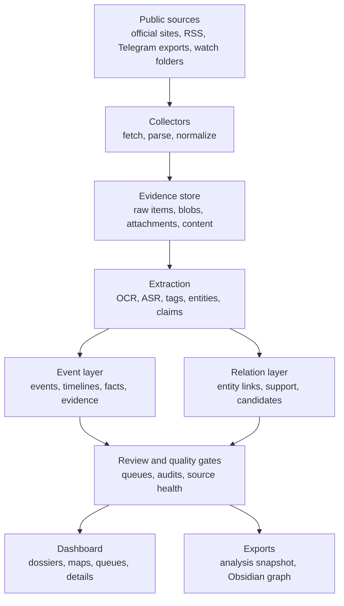

# Civic Evidence Lab

Civic Evidence Lab turns public records, media, posts, documents, and collected
files into a structured evidence workspace. It collects source material, extracts
claims and events, links entities, builds timelines, and keeps every analytical
result traceable back to the material that produced it.

The system is built for civic research, investigative analysis, editorial
verification, and long-running monitoring of public-interest signals. Its focus
is not volume alone: the useful output is a navigable evidence graph where
sources, files, claims, events, facts, entities, relations, and review decisions
stay connected.

## Demo

https://www.youtube.com/watch?v=4t4TnES-7Kc

The video shows the volume of information collected during one test run.

## Core Capabilities

- Multi-source collection from official websites, registries, RSS feeds,
  Telegram exports, watch folders, documents, images, audio, and video.
- Canonical storage for raw source items, file blobs, attachments, normalized
  content, claims, entities, events, facts, evidence links, and relation
  candidates.
- OCR, ASR, text extraction, tagging, semantic indexing, claim normalization,
  entity extraction, and event synthesis.
- Source-health checks, review queues, classifier audits, quality gates, and
  relation promotion rules for safer downstream analysis.
- Investigation views for dossiers, claims, events, facts, bridge paths,
  involvement maps, relation graphs, and source status.
- Export pipelines for derived analysis snapshots and Obsidian graph vaults.

## Pipeline



## Workspace

The desktop shell is an operator console over the collected corpus. It exposes
runtime jobs, review queues, source-health state, dashboards, investigation
graphs, relation maps, event details, and export actions from one place.

The analysis layer is intentionally incremental: collectors and extractors add
material, classifiers and verification stages enrich it, relation builders
connect it, and quality gates decide whether a derived snapshot or export should
be produced.

## Repository Layout

| Path | Purpose |
| --- | --- |
| `analysis/` | AI sweep, event pipeline, and relation analysis |
| `cases/` | Accountability, involvement, and risk case builders |
| `claims/` | Claim extraction helpers |
| `classifier/` | Tagging, semantic index, audit, and classification logic |
| `collectors/` | Telegram, RSS, official-source, registry, and watch-folder collectors |
| `config/` | Example settings, source manifests, and seed data |
| `db/` | Schema, migrations, backup helpers, and file-store code |
| `enrichment/` | Deduplication, profiles, disclosures, assets, and restrictions |
| `graph/` | Relation candidate logic |
| `investigation/` | Dossier and graph exploration APIs |
| `llm/` | Provider key pool and model routing |
| `media_pipeline/` | OCR and ASR integrations |
| `ner/` | Entity extraction and resolution |
| `quality/` | Pipeline gate checks |
| `runtime/` | Job registry, daemon, scheduler, state, and orchestration |
| `search/` | Search helpers |
| `tests/` | Unit and smoke tests |
| `tools/` | CLI utilities for snapshots, exports, audits, and imports |
| `ui/`, `ui_web/` | Desktop shell and embedded web dashboard |
| `verification/` | Evidence linking, contradiction checks, and re-verification |

## Quick Start

```powershell
py -3 -m venv .venv
.\.venv\Scripts\Activate.ps1
python -m pip install -U pip
pip install -r requirements.txt
playwright install
Copy-Item config\settings.example.json config\settings.json
```

Create or update the schema:

```powershell
python -m db.migrate --no-legacy
```

Launch the dashboard:

```powershell
python main.py
```

Run the daemon:

```powershell
python -m runtime.daemon
```

Run a single job:

```powershell
python -m runtime.run_job --job source_health
python -m runtime.run_job --job event_pipeline
python -m runtime.run_job --job quality_gate
```

Run a full pipeline:

```powershell
python -m runtime.run_pipeline --mode nightly
```

## Runtime Jobs

| Job | Purpose |
| --- | --- |
| `source_health` | Check configured source availability and fallback status |
| `watch_folder` | Ingest files from configured folders |
| `telegram`, `rss`, `official` | Collect configured source families |
| `tagger`, `semantic_index` | Classify and index normalized content |
| `event_pipeline` | Build events, timelines, and event facts |
| `relations` | Build entity relation candidates |
| `quality_gate` | Validate whether derived publication can proceed |
| `analysis_snapshot` | Build the derived analysis database |
| `obsidian_export` | Export graph notes and attachments |
| `ai_full_sweep` | Run the AI work queue manually |

Registered jobs are defined in `runtime/registry.py`.

## Configuration

Start from `config/settings.example.json`, then adjust paths, source intervals,
Telegram credentials, proxy settings, model/provider settings, and export
targets for the target environment.

Important settings include:

- `db_path`
- `analysis_db_path`
- `legacy_db_path`
- `obsidian_export_dir`
- `telegram_api_id`
- `telegram_api_hash`
- `telegram_session_dir`
- `ai_sweep.key_file`
- `http_proxy`
- `https_proxy`

## Verification

Run the maintained test suite:

```powershell
python -m unittest discover -s tests -v
```

Useful lightweight checks:

```powershell
python -m py_compile db\file_store.py db\migrate.py runtime\registry.py
python -m runtime.run_job --job source_health
python -m runtime.run_job --job quality_gate
```
