# Reactor v2 Architecture

## Why the current system underperforms

The current implementation has many useful stages, but the stages write directly
into shared domain tables. Parser output, LLM proposals, event projections,
relation candidates and public edges do not share one promotion and provenance
contract. As a result, volume grows faster than verified knowledge.

The live audit found:

- 4,195 events, but 3,557 (84.8%) have no current facts;
- 8,610 relation candidates and 287,815 support rows;
- 6,318 `same_case_cluster` seed rows;
- 874 event/fact candidates with dangling event/fact support;
- 965 promoted candidates, but only one candidate-backed physical relation;
- 24,653 of 27,892 claims without a direct evidence link;
- 2 MAS tasks, 0 messages, 0 artifacts and 0 search evidence;
- multiple stale `pipeline_runs='running'` without active leases.

## Canonical flow

```mermaid
flowchart LR
    S[Source] --> F[Fetch attempt]
    F --> R[Immutable source revision]
    R --> D[Derivation run]
    D --> P[Assertion proposal]
    P --> E[Evidence and exact locator]
    E --> V[Verification and review]
    V --> G[Projection generation]
    G --> C[Current and as-of views]
    C --> U[UI, API and export]
```

Raw and derived data are not public truth. A public fact or relation must point
to a source revision, a transform/model run, an exact evidence locator and the
projection generation that activated it.

## Relation contract

Signals and assertions are different objects:

- Signals: co-mention, same case, same bill, semantic similarity, community.
- Assertions: typed subject-predicate-object statements with polarity, time,
  explicit fact arguments and evidence.

Only assertions can become public relations. Signals can retrieve candidates or
prioritize review, but can never materialize an entity-to-entity fact.

Promotion requires one of:

- one E3 primary/official evidence item with entailment at least 0.92; or
- two independent E2+ evidence owners with entailment at least 0.80, including
  one non-social or primary source.

OCR and Telegram screenshots remain E1 until document authenticity is
`confirmed` or `likely`. Generic locations, aliases, self-edges and unsupported
role/predicate combinations are rejected before scoring.

## Temporal model

Each assertion carries:

- `valid_from/valid_to`: when it was true;
- `observed_at`: when the source reported it;
- `recorded_at`: when the platform stored it;
- `superseded_at`: when a newer revision replaced it.

Projection generations are built in staging and switched atomically. UI and
exports read only the active generation through canonical views.

## Runtime contract

There is one scheduling plane and one writer policy. Every job attempt has an
owner-checked lease, heartbeat, deadline, retry class and dead-letter outcome.
Monitoring errors are visible errors, not empty successful metrics.

MAS agents write proposals, messages and artifacts. They do not mutate truth.
The deterministic verifier and projection publisher own promotion.

## UI contract

The desktop product is an investigation workbench, not a table viewer:

- navigation rail for domains;
- central result workspace with real server-side search and pagination;
- independent inspector with Summary, Evidence, Timeline, Relations and Raw;
- Review Ops with explicit decisions and audit history;
- relation explorer centered on Event -> Fact -> Evidence paths;
- operations cockpit with incidents, freshness, throughput and bottlenecks.
